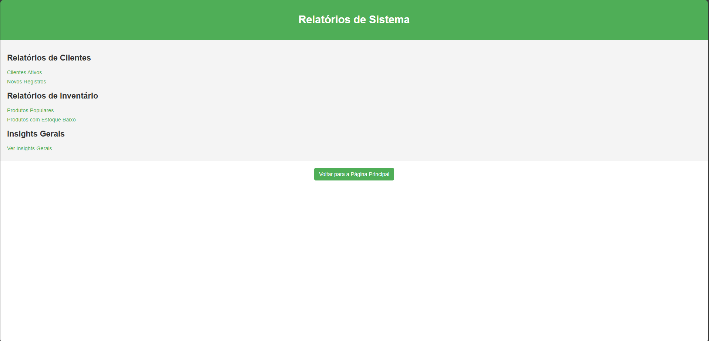

# Sistema de Gestão de Clientes, Inventário e Relatórios



Este projeto implementa um sistema baseado em **APIs RESTful** para gerenciamento de **clientes**, **inventário de produtos** e **relatórios analíticos**, com foco em **segurança e infraestrutura**. O sistema é projetado para ser executado com **Docker**, utilizando **MySQL** e **MongoDB** para armazenamento de dados.

## Principais Funcionalidades

- **API de Gestão de Clientes**: CRUD para cadastro e gerenciamento de clientes.
- **API de Inventário**: Controle de estoque, incluindo informações sobre fornecedores e itens armazenados.
- **API de Relatórios**: Geração de relatórios analíticos sobre clientes e inventário.
- **Home API**: Interface acessível em `http://principal.localhost/`, com botões para navegar entre os serviços.

## Arquitetura do Projeto

O projeto está estruturado com **separação de IPs e redes** para garantir maior segurança e isolamento dos serviços:

- **Docker Networks Customizadas**: Cada API opera em uma rede isolada, permitindo comunicação apenas com serviços necessários.
- **Gerenciamento de Credenciais**: As credenciais dos bancos de dados são protegidas e não ficam expostas.
- **Logs Centralizados**: Permite auditoria e monitoramento eficiente das APIs.
- **Restrições de Acesso**: Controle rigoroso para evitar acessos não autorizados.

### Serviços e Portas

- **Home API** (interface principal): `http://principal.localhost/`
- **Clientes API**: `http://clientes.localhost/`
- **Inventário API**: `http://inventario.localhost/`
- **Relatórios API**: `http://relatorios.localhost/`

## Pré-requisitos

Para rodar o projeto, é necessário ter instalado:

- **Docker** (instalado e ativado)
- **MySQL** (instalado e rodando)

## Como Rodar o Projeto

### 1. Clonar o Repositório

```bash
git clone https://github.com/miguel-ffo/Redes-Miguel/tree/api.git
cd seu-repositorio/apps/
```

### 2. Criar as Redes

```powershell
./start_networks.ps1
```

### 3. Criar as Imagens e Subir os Containers

```powershell
./start_services.ps1
```

### 4. Acessar a Home API

Após subir os containers, acesse **`http://principal.localhost/`** para navegar entre os serviços.

## Estrutura do Projeto

```bash
.
├── apps/
│   ├── cliente/
│   ├── inventario/
│   ├── relatorio/
│   ├── home-api/
│   ├── start_networks.ps1
│   ├── start_services.ps1
│   └── manage.py
├── docker-compose.yml
├── Dockerfile
├── requirements.txt
└── README.md
```

## Contribuição

Para contribuir com o projeto:

1. Faça um fork do repositório.
2. Crie uma branch para suas alterações:
   ```bash
   git checkout -b minha-feature
   ```
3. Faça suas modificações e commit:
   ```bash
   git commit -m "Descrição das mudanças"
   ```
4. Envie para o repositório remoto:
   ```bash
   git push origin minha-feature
   ```
5. Abra um pull request.

## Licença

Este projeto está sob a **Licença MIT**. Consulte o arquivo [LICENSE](LICENSE) para mais informações.
